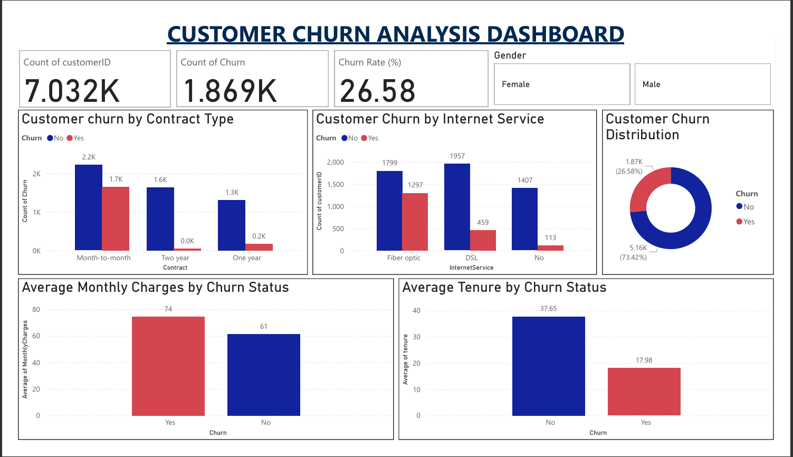

# 📊 Customer Churn Analysis Dashboard

This project presents a data-driven analysis of telecom customer churn using **Python** for data cleaning and **Power BI** for dashboard creation. It identifies key customer behavior patterns that lead to churn and provides visual insights for business decision-making.

---

## 🎯 Objectives

- Clean and preprocess telecom churn data using Python
- Identify key customer attributes that influence churn
- Build an interactive Power BI dashboard to visualize churn patterns
- Help businesses take data-backed retention decisions
- Gain hands-on experience in end-to-end data analytics workflow

---

## 🔍 Project Highlights

- Real-world telecom churn dataset from Kaggle
- Python used for missing value handling and EDA
- Power BI used for building a clean, interactive dashboard:
  - KPI cards for totals and churn rate
  - Donut chart to show churn distribution
  - Bar charts to compare churn by contract type and services
  - Slicers for gender-based filtering

---

## 🛠️ Tech Stack

- **Python** (Pandas, Jupyter Notebook)
- **Power BI** (for visualization)

---

## 📂 Files Included

| File Name                        | Description                                   |
|----------------------------------|-----------------------------------------------|
| `customer_churn_cleaned.xlsx`    | Final cleaned dataset used in Power BI        |
| `churn_data_cleaning_and_eda.ipynb` | Jupyter Notebook: Cleaning + EDA          |
| `Customer_churn_analysis.pbix`  | Power BI dashboard (main project file)        |
| `dashboard_screenshot.png`       | Final dashboard preview image                 |
| `README.md`                      | This documentation file                       |

---

## 📈 Dashboard Preview

---

## 📌 Key Insights

- 📉 **Month-to-month** contract users have the **highest churn**
- 🌐 Customers with **Fiber optic** internet are more likely to churn
- 💰 Higher **monthly charges** correlate with higher churn probability
- ⏳ Customers with **longer tenure** are less likely to churn

---

## 📁 Dataset Source

> [Telco Customer Churn – Kaggle Dataset](https://www.kaggle.com/datasets/blastchar/telco-customer-churn)

---

